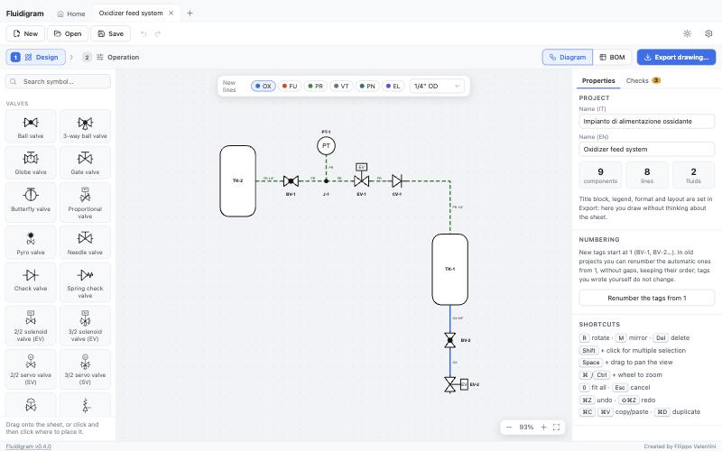
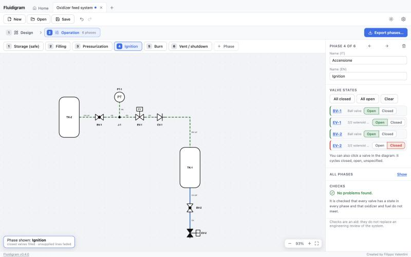
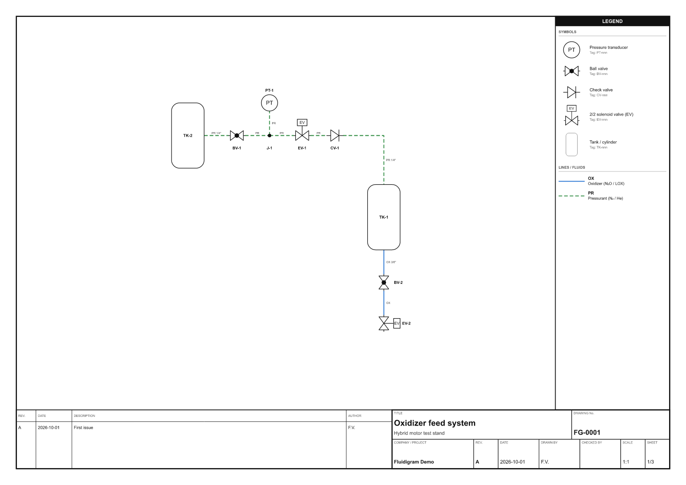
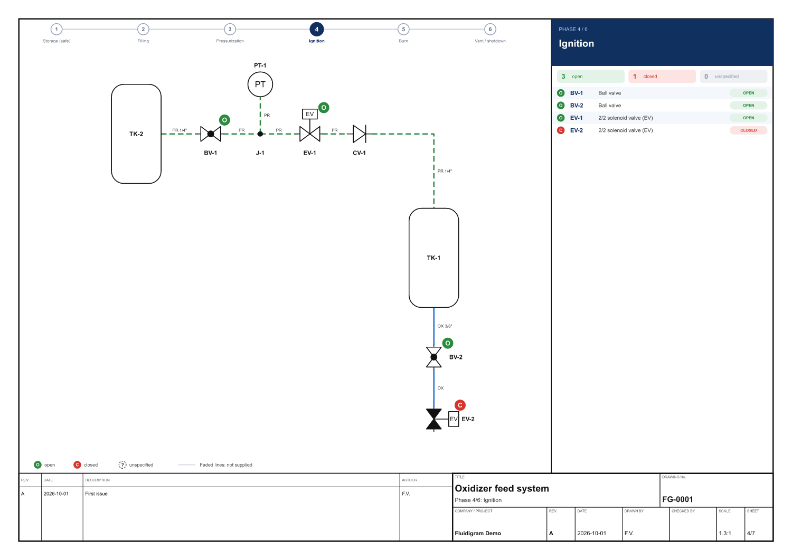

<p align="center">
  
</p>

<h1 align="center">Fluidigram</h1>

<p align="center">
  <b>Draw professional fluid-system diagrams (P&amp;ID) for model rocketry — then describe how they work, phase by phase.</b><br>
  Works offline on macOS and Windows · English and Italian
</p>

<p align="center">
  <a href="../../releases/latest"></a>
  <a href="../../actions/workflows/ci.yml"></a>
  
  
</p>

<p align="center">
  <b>English</b> · <a href="#italiano">Italiano</a>
</p>

---

## What is Fluidigram?

Fluidigram is a desktop app for drawing the **fluid diagrams** of a rocket test stand or a launch system: tanks, valves, sensors, regulators, injectors and the lines between them, in the style of a P&ID. It was made for model and amateur rocketry, where the plumbing has to be clear, checkable and well documented — without the price and complexity of industrial CAD.

It does one thing: **draw fluid diagrams and document how they operate.** Everything else is an optional module, off by default. Your projects are plain files on your computer; nothing is uploaded anywhere.

<p align="center">
  
</p>

## Highlights

**Draw**
- A library of symbols (valves with solenoid, servo, pneumatic or manual actuators, tanks, regulators, injectors, quick disconnects, sensors and more), with automatic orthogonal routing of the lines.
- Sensors that mount directly on tanks and on the combustion chamber; analog gauges with a dial, other instruments with their fixed letters.
- Tags numbered automatically (BV-1, EV-2, TK-1…), fluids and pipe sizes on every line, open ends declared as *vent* or *from/to another system*.
- Copy, paste, rotate, mirror, quick replacement of one valve type with another, undo and redo.

**Check**
- A checks panel reports what is really missing or wrong: unconnected ports, mixed fluids, pressure above a component limit, valves without a rest state or a phase state. Optional suggestions can be turned on; any warning can be ignored.
- An editable **bill of materials**, in groups, in Italian and English.

**Describe how it works**
- A separate **Operation** step: define the phases (filling, pressurization, ignition…) and set every valve *open* or *closed* in each of them, with buttons or by clicking the valve in the diagram.

<p align="center">
  
</p>

**Export**
- PDF, SVG and PNG with title block, legend, revision table and an automatic multi-sheet layout, in Italian or English, in color or black and white.
- A dedicated **operating-phases PDF**: one page per phase, with a colored badge on every valve, a written state table and a summary matrix.

<table>
  <tr>
    <td width="50%"><br><sub>The exported drawing: title block, legend, tags, fluids.</sub></td>
    <td width="50%"><br><sub>One page per operating phase, with the state of every valve.</sub></td>
  </tr>
</table>

**Everyday comfort**
- Home page with recent files and recovery of unsaved work; double-click a `.fluidigram` file to open it; native menu and shortcuts.
- Interface in **English and Italian**, following your system language (changeable in Settings).
- Light and dark themes. An optional **calculators module** (N₂O injector, gas orifices, pressure drop, Cv), off by default.

## Download

Get the latest installer from the **[Releases page](../../releases/latest)**:

| System | File |
|---|---|
| macOS 11+ (Apple Silicon and Intel) | `Fluidigram_x.y.z_macOS.pkg` — guided installer: installs or updates the app in Applications (asks your password once) |
| Windows 10/11 (64-bit) | `Fluidigram_x.y.z_x64-setup.exe` — guided installer, installs for your user, no administrator rights |

The app is **not code-signed yet** (Apple and Microsoft charge for it), so your system shows a warning the first time. This is expected and does not mean the app is a virus:

- **macOS** — press *Done*, then open **System Settings → Privacy & Security**, scroll to *Security* and press **Open Anyway**. Or run `xattr -cr /Applications/Fluidigram.app` in Terminal before opening it.
- **Windows** — on the blue *“Windows protected your PC”* screen click **More info**, then **Run anyway**.

Step-by-step instructions are also in every [release](../../releases).

### Updates

Fluidigram checks for new versions by itself once a day and shows a **red dot** on the Settings button when one is out. In **Settings → Updates**, press **Update now**: the app downloads the new version, verifies its signature, installs it and restarts. You can turn the automatic check off in the same page.

### Privacy

The app works fully offline and your projects never leave your computer. The **only** network request it makes is the update check, which asks `github.com` for the latest published release: a standard web request (your IP address and the app name) and nothing else.

## For developers

Built with [Tauri](https://tauri.app/) (Rust), React, TypeScript and Vite. The code is in English and covered by tests.

```
src/
  core/      diagram model, symbols, routing, checks, layout and export (pure, no React)
  state/     app state: project tabs, undo/redo, session and settings
  ui/        editor: canvas, library, inspector, steps, export, settings
  i18n/      interface translations (English source strings, Italian dictionary)
  modules/   OPTIONAL MODULES, independent from the diagram
  platform/  desktop integration (files, menu, updates, exporters)
src-tauri/   native shell (Rust): file association, native menu, installers, updater
docs/        distribution and release notes for maintainers
```

Dependency rule: `core ← state ← ui ← App`; modules may use them but **nothing depends on modules except `App.tsx`** (checked by a test).

| Command | What it does |
|---|---|
| `npm ci` | install dependencies (Node.js 22, see `.nvmrc`) |
| `npm run dev` | browser only, at http://localhost:5173 |
| `npm run tauri dev` | native app in development (needs [Rust](https://rustup.rs/) and the [Tauri prerequisites](https://tauri.app/start/prerequisites/)) |
| `npm test` · `npx tsc -b` · `npm run lint` | tests · type check · lint |
| `npm run tauri build` | installable app |

See [CONTRIBUTING.md](CONTRIBUTING.md), the [CHANGELOG](CHANGELOG.md) and [docs/DISTRIBUTION.md](docs/DISTRIBUTION.md).

## License

Created by **Filippo Valentini**. Free to use; see [LICENSE](LICENSE).

---

<a id="italiano"></a>

<p align="center">
  <a href="#fluidigram">English</a> · <b>Italiano</b>
</p>

## Che cos'è Fluidigram?

Fluidigram è un'app per computer per disegnare gli **schemi fluidici** di un banco prova o di un sistema di lancio per razzi: serbatoi, valvole, sensori, regolatori, iniettori e le linee che li collegano, in stile P&ID. È pensata per il razzomodellismo e l'amatoriale, dove l'impianto deve essere chiaro, verificabile e ben documentato — senza il costo e la complessità dei CAD industriali.

Fa una cosa sola: **disegnare schemi fluidici e documentarne il funzionamento.** Tutto il resto è un modulo opzionale, spento di base. I tuoi progetti sono semplici file sul tuo computer; niente viene caricato da nessuna parte.

## In breve

**Disegna**
- Una libreria di simboli (valvole con azionamento elettrico, servo, pneumatico o manuale, serbatoi, regolatori, iniettori, attacchi rapidi, sensori e altro), con instradamento ortogonale automatico delle linee.
- Sensori che si montano direttamente sui serbatoi e sulla camera di combustione; strumenti analogici con quadrante, gli altri con la loro sigla fissa.
- Tag numerati in automatico (BV-1, EV-2, TK-1…), fluido e diametro su ogni linea, estremità libere dichiarate come *sfiato* o *da/verso un altro impianto*.
- Copia, incolla, ruota, specchia, sostituzione rapida di un tipo di valvola con un altro, annulla e ripeti.

**Controlla**
- Un pannello dei controlli segnala ciò che manca o è sbagliato davvero: porte non collegate, fluidi mischiati, pressione oltre il limite di un componente, valvole senza stato a riposo o senza stato in una fase. I suggerimenti facoltativi si possono accendere; ogni avviso si può ignorare.
- Una **distinta componenti** modificabile, a gruppi, in italiano e inglese.

**Descrivi come funziona**
- Un passo separato, **Funzionamento**: definisci le fasi (riempimento, pressurizzazione, accensione…) e imposti ogni valvola su *aperta* o *chiusa* in ciascuna, con i pulsanti o cliccando la valvola nello schema.

**Esporta**
- PDF, SVG e PNG con cartiglio, legenda, tabella delle revisioni e impaginazione automatica su più fogli, in italiano o inglese, a colori o in bianco e nero.
- Un **PDF delle fasi di funzionamento** dedicato: una pagina per fase, con un pallino colorato su ogni valvola, una tabella scritta degli stati e una matrice riassuntiva.

**Comodità di ogni giorno**
- Pagina iniziale con i file recenti e recupero del lavoro non salvato; doppio clic su un file `.fluidigram` per aprirlo; menu nativo e scorciatoie.
- Interfaccia in **italiano e inglese**, secondo la lingua del sistema (si cambia dalle Impostazioni).
- Temi chiaro e scuro. Un **modulo di calcolo** opzionale (iniettore N₂O, orifizi per gas, perdite di carico, Cv), spento di base.

## Scarica

Prendi l'ultimo installer dalla **[pagina delle release](../../releases/latest)**:

| Sistema | File |
|---|---|
| macOS 11+ (Apple Silicon e Intel) | `Fluidigram_x.y.z_macOS.pkg` — installer guidato: installa o aggiorna l'app in Applicazioni (chiede la password una volta) |
| Windows 10/11 (64 bit) | `Fluidigram_x.y.z_x64-setup.exe` — installer guidato, installa per il tuo utente, senza permessi di amministratore |

L'app **non è ancora firmata** (Apple e Microsoft la fanno pagare), quindi la prima volta il sistema mostra un avviso. È normale e non significa che l'app sia un virus:

- **macOS** — premi *Fine*, poi apri **Impostazioni di Sistema → Privacy e sicurezza**, scorri fino a *Sicurezza* e premi **Apri comunque**. Oppure esegui `xattr -cr /Applications/Fluidigram.app` da Terminale prima di aprirla.
- **Windows** — sulla schermata blu *«Windows ha protetto il PC»* clicca **Ulteriori informazioni**, poi **Esegui comunque**.

Le istruzioni passo per passo sono anche in ogni [release](../../releases).

### Aggiornamenti

Fluidigram controlla da solo una volta al giorno se c'è una versione nuova e mostra un **pallino rosso** sul pulsante Impostazioni. In **Impostazioni → Aggiornamenti** premi **Aggiorna ora**: l'app scarica la nuova versione, ne verifica la firma, la installa e si riavvia. Il controllo automatico si spegne nella stessa pagina.

### Privacy

L'app funziona del tutto offline e i tuoi progetti non lasciano mai il tuo computer. L'**unica** richiesta di rete è il controllo degli aggiornamenti, che chiede a `github.com` l'ultima release pubblicata: una normale richiesta web (il tuo indirizzo IP e il nome dell'app) e nient'altro.

## Per chi sviluppa

Realizzata con [Tauri](https://tauri.app/) (Rust), React, TypeScript e Vite. Il codice è in inglese e coperto da test. La struttura del progetto, i comandi e le regole di contribuzione sono nella [sezione in inglese](#for-developers), in [CONTRIBUTING.md](CONTRIBUTING.md) e in [docs/DISTRIBUTION.md](docs/DISTRIBUTION.md).

## Licenza

Creata da **Filippo Valentini**. Uso libero; vedi [LICENSE](LICENSE).
